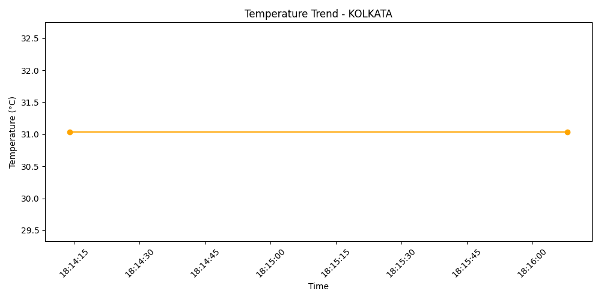

# 🌦️ Weather Tracker — Python + OpenWeather API

A simple ETL pipeline that fetches live weather data, stores it in a CSV, and visualizes temperature trends.

---

## 🔧 Tech Used

- Python 3
- OpenWeather API
- Pandas
- Matplotlib

---

## 📦 What It Does

| Step | Description |
|------|-------------|
| ☁️ Fetch | Pulls live weather data (temp, humidity) from OpenWeather API |
| 💾 Store | Appends it into a CSV for historical tracking |
| 📊 Visualize | Plots the last 7 entries in a line chart |

---

## 📁 Project Structure

---
weather-tracker/
  -- weather_etl.py ← Main script
  --weather_history.csv ← Auto-generated history
output/
  --temperature_trend.png ← Auto-generated chart

## 📈 Sample Output Chart

---

## 🔖 Tags

`#python` `#openweather` `#etl` `#pandas` `#data-engineering` `#matplotlib`
